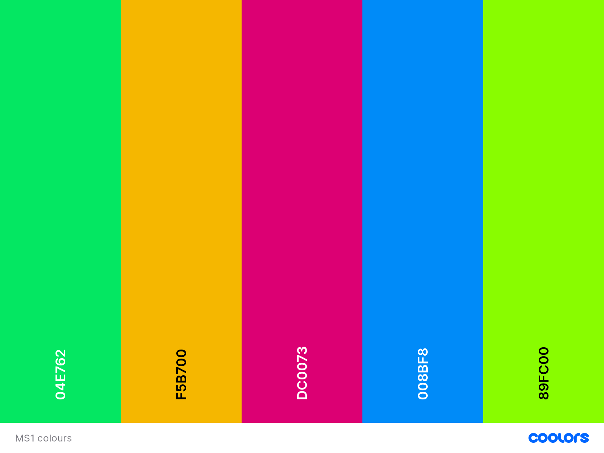
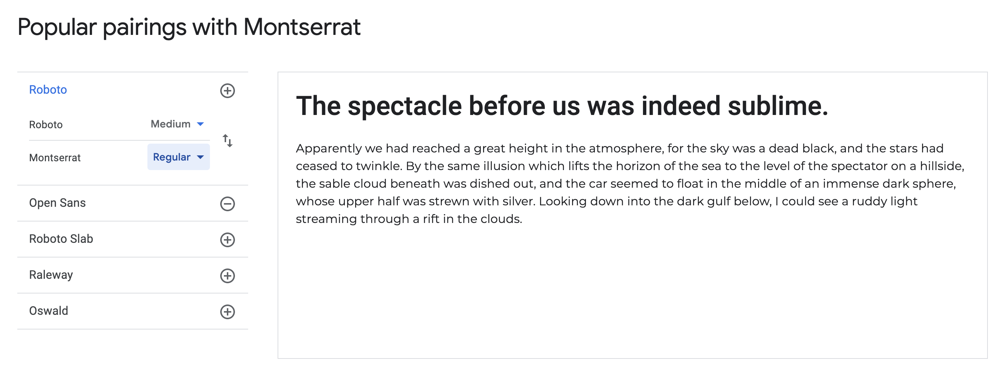

# 'Dice and Lattes' Board Game Cafe, Caerphilly
### An assessed project for the Code Institute

Dice and Lattes is a new cafe in the heart of Caerphilly which doesn't just offer **exceptional** coffes, **responsibly sourced**, but also invites you to sit and enjoy a game with friends. 

Alongside the extensive and growing collection of **board games**, our **Game Experts** will assist with game learning and make recommendations appropriate to guests requirements (such as player number and skill). Furthermore, excellent customer service through teaching these games to customer will keep people wanting to come and game!

## Contents

* User Experience and Design
    * High Level Idea
    * User Stories
    * High Level Needs and Trade-offs
    * Colour and Typography Design

* Technologies Used
* Deployment
* Bugs and Issues
* Acknowledgement
* Disclaimer

## User Experience and Design

## High Level Idea

A website to be created that will highlight the uniqueness of the board game cafe setup, as compared ot a traditional cafe. It should be approachable and not scare off new potential users wiht jargon, whilst also being reassuring to experienced players. It is assumed most users will be new to the site, and a majority of these will also be new or relatviely new to 'hobby' games. As well as explaining the concept, it will need to be easy to contac tthe cafe to make bookings and enquiries, and contact thorugh social media outlets too. It will need to be a responsive website. In the UK in 2020 the most important device for internet access is now the smartphone ([source](https://www.statista.com/statistics/387447/consumer-electronic-devices-by-internet-access-in-the-uk/)) and people will be relishing the opportunity to be out and about in 2021. 

The needs of the **business owners**, and **customers** have been considered in the designing phase of this project. These have been summerised into the following user stories:

### User Stories:
As a **business owner** I want a website so that I can expose my business more. In doing this our aims are that:
* More people know about the business locally.
* The concept is easily and clearly explained.
* Customers can find the cafe and contact us, both directly and through our social media (Facebook, Twitter and Instagram). 
* A focus on the menu as well as games.
* The website is attractive and intuitive to potential customers. 
* There is a way to book tables and sell games. 

As a **customer** I want a website to understand what makes this cafe special. To do this I need:
* Information on what is different about this cafe, easily digestible and clearly explained. 
* A link to social media. 
* Information about the menu and pricing. 
* Information about how to find and contact the cafe. 
* To be able to book tables direct from the website. 

### High level Needs and Trade-offs:

There are several identified needs from these stories. In dicussion with the client, these were ranked from most to least important:

1. An attractive and well designed website. 
2. Information about the business incluing the concept, location and contact details. 
3. A way to contact the cafe from the website.
4. A shop where you can purchase games and pre-book tables.
5. A menu and pricing information. 
6. A gallery page.

These were taken and assessed agains the limitations of time and buget, and given related viability / feasability score (opportunity numbers relate to above):

| Opportunity      | Importance    | Viability     |
| :-------------:   | :----------:  | :-----------: |
| 1                | 5             | 5              |
| 2                | 5             | 5              |
| 3                | 4             | 5              |
| 4                | 4             | 1              |
| 5                | 3             | 5              |
| 6                | 2             | 4              |

From this exercise it was clear that there needed to be some compromise on the scope of the project. It was agreed that the most viable elements scored as a 5 should be those to make up the initial release of the website, wiht the online shop to be a feature held back until a future release of the website. 

Therefore, the key requirements of the initial website were:
* An attractive and well designed website. 
* Information about the business incluing the concept, location and contact details. 
* A way to contact the cafe from the website.
* A menu and pricing information.

### Colour and Typography Design:

From the requirements it is clear to see an attractive website design, appealing to potential customers is key. There does not need to be blocks of technical language, graphs or tables, but images and summaries which will be enticing to customers. 

Board games come with their own shorthand mental shortcuts for colour and we are all familiar with the bold primary colors of red, blue and yellow being used for pieces. There is a fear of uing too bold and bright colour being garish and harsh, so palettes were experimented with to give a general direction with colours for the project. Using the [coolers](https://coolors.co/04e762-f5b700-dc0073-008bf8-89fc00) website such a pallete was found, although this is an area which may be experimented on more as the project develops, usability and readability being important. 

In terms of fonts, readability was the key to chosen fonts, as well as being conscious of needing to make a positive impression in potentially a short space of time. For these reasons, two popular fonts have been chosen 'Roboto' for header elements and 'Montserrat' for the main text elements.

### Wireframes:

From the requirements of the website it was decided the initial release should include 3 pages:
  * A home page which will include the headline informaiton about the cafe and the concept. Contact informaiton such as location and social media links should also be included. 
  * A menu page which should highlight the food and drinks on offer. 
  * A contact page which will highlight social media links as well as include a form for comments and questions. 

Wireframes of the pages for mobile / small and laptop / large screens can be found below:

#### Large Screens / laptops:

* [Home/Index](assets/images/wireframes/Laptop-Screen-Home.png)
* [Menu](assets/images/wireframes/Laptop-Screen-Menu.png)
* [Contact](assets/images/wireframes/Laptop-Screen-Contact.png)

#### Small screens / mobiles:

* [Home/Index](assets/images/wireframes/Mobile-Home.png)
* [Menu](assets/images/wireframes/Mobile-Menu.png)
* [Contact](assets/images/wireframes/Mobile-Contact.png)

### Acknowledgements:

Where pre-made code has been used and not directly attributed to in HTML / CSS it is below:

Markdown table syntax taken and adapted from: https://www.makeuseof.com/tag/create-markdown-table/#:~:text=Markdown%20makes%20it%20simple%20to,even%20make%20tables%20with%20Markdown.

Markdown image syntax taken and adapted from: https://marinegeo.github.io/2018-08-10-adding-images-markdown/

### Disclaimer

This project is completed for the purposes of evaluation by the Code Institute towards a Diploma in Web Development. It is purely for educational purposes and is not intended as a commercial venture. 

All non-attributed code and content is created by Michael Pearce. See me on [GitHub](https://github.com/michaelpearce21/)

