# 'Dice and Lattes' Board Game Cafe, Caerphilly
### An assessed project for the Code Institute

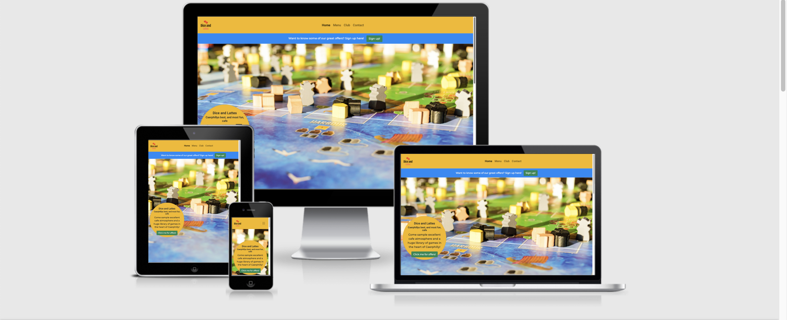

[Live version of website](https://michaelpearce21.github.io/CI_MS1_DAL/)

Dice and Lattes is a new cafe in the heart of Caerphilly which doesn't just offer **exceptional** coffes, **responsibly sourced**, but also invites you to sit and enjoy a game with friends. 

Alongside the extensive and growing collection of **board games**, our **Game Experts** will assist with game learning and make recommendations appropriate to guests requirements (such as player number and skill). Furthermore, excellent customer service through teaching these games to customer will keep people wanting to come and game!

## Contents

* User Experience and Design
  * High Level Idea
  * User Stories
  * High Level Needs and Trade-offs
  * Colour and Typography Design
  * Wireframes
* Features and Testing User Stories
* Technologies Used
* Testing
  * General testing of features and navigation
  * Validation testing
  * Accesibility testing
* Deployment
* Bugs and Issues
* Acknowledgement
* Disclaimer

## User Experience and Design

## High Level Idea

A website to be created that will highlight the uniqueness of the board game cafe setup, as compared ot a traditional cafe. It should be approachable and not scare off new potential users wiht jargon, whilst also being reassuring to experienced players. It is assumed most users will be new to the site, and a majority of these will also be new or relatviely new to 'hobby' games. As well as explaining the concept, it will need to be easy to contac tthe cafe to make bookings and enquiries, and contact thorugh social media outlets too. It will need to be a responsive website. In the UK in 2020 the most important device for internet access is now the smartphone ([source](https://www.statista.com/statistics/387447/consumer-electronic-devices-by-internet-access-in-the-uk/)) and people will be relishing the opportunity to be out and about in 2021. 

The needs of the **business owners**, and **customers** have been considered in the designing phase of this project. These have been summerised into the following user stories:

### User Stories:
As a **business owner** I want a website so that I can expose my business more (1-7).

As a **customer** I want a website to understand what makes this cafe special. (8-12):

As a **regular user** I want a wesite to keep up to date 
with events and recommendations. (13-15):

To meet these needs we need:

1. More people know about the business locally.
2. The concept is easily and clearly explained.
3. Customers can find the cafe and contact us, both directly and through our social media (Facebook, Twitter and Instagram). 
4. A focus on the menu as well as games.
5. The website is attractive and intuitive to potential customers. 
6. There is a way to book tables and sell games. 
7. A way to keep in touch with customers who are regulars as well as new users. 
8. Information on what is different about this cafe, easily digestible and clearly explained. 
9. A link to social media. 
10. Information about the menu and pricing. 
11. Information about how to find and contact the cafe. 
12. To be able to book tables direct from the website. 
13. A newsletter which may include dates of events and special offers.
14. A membership to encourage repeat returns.
15. Game recommendations for my visits.

### High level Needs and Trade-offs:

There are several identified needs from these stories. In dicussion with the client, these were ranked from most to least important:

1. An attractive and well designed website. 
2. Information about the business incluing the concept, location and contact details. 
3. A way to contact the cafe from the website.
4. A shop where you can purchase games and pre-book tables.
5. A menu and pricing information. 
6. A gallery page.

These were taken and assessed agains the limitations of time and buget, and given related viability / feasability score (opportunity numbers relate to above):

| Opportunity      | Importance    | Viability     |
| :-------------:   | :----------:  | :-----------: |
| 1                | 5             | 5              |
| 2                | 5             | 5              |
| 3                | 4             | 5              |
| 4                | 4             | 1              |
| 5                | 3             | 5              |
| 6                | 2             | 4              |

From this exercise it was clear that there needed to be some compromise on the scope of the project. It was agreed that the most viable elements scored as a 5 should be those to make up the initial release of the website, wiht the online shop to be a feature held back until a future release of the website. 

Therefore, the key requirements of the initial website were:
* An attractive and well designed website. 
* Information about the business incluing the concept, location and contact details. 
* A way to contact the cafe from the website.
* A menu and pricing information.

### Colour and Typography Design:

From the requirements it is clear to see an attractive website design, appealing to potential customers is key. There does not need to be blocks of technical language, graphs or tables, but images and summaries which will be enticing to customers. 

Board games come with their own shorthand mental shortcuts for colour and we are all familiar with the bold primary colors of red, blue and yellow being used for pieces. There is a fear of uing too bold and bright colour being garish and harsh, so palettes were experimented with to give a general direction with colours for the project. Using the [coolers](https://coolors.co/04e762-f5b700-dc0073-008bf8-89fc00) website such a pallete was found, although this is an area which may be experimented on more as the project develops, usability and readability being important. 

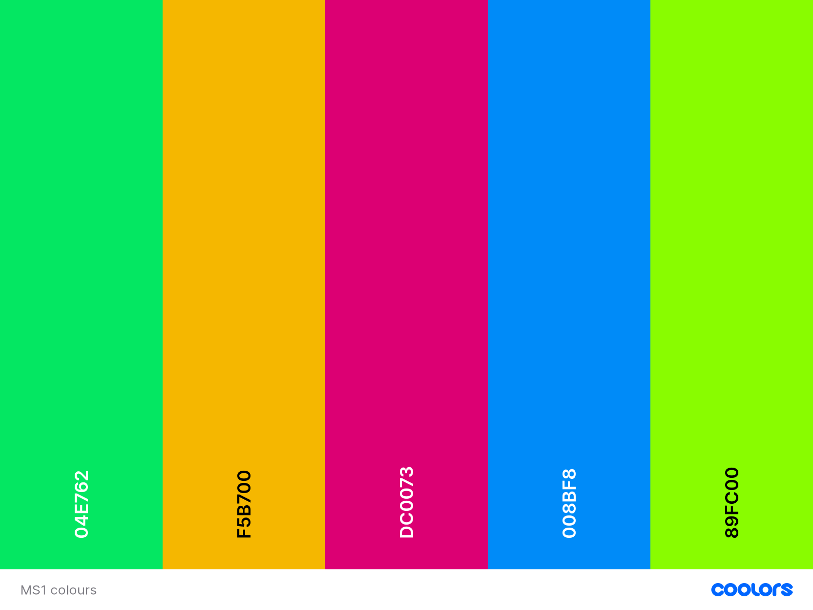

In terms of fonts, readability was the key to chosen fonts, as well as being conscious of needing to make a positive impression in potentially a short space of time. For these reasons, two popular fonts have been chosen 'Roboto' for header elements and 'Montserrat' for the main text elements.

### Wireframes:

From the requirements of the website it was decided the initial release should include 4 pages:
  * A home page which will include the headline informaiton about the cafe and the concept. Contact informaiton such as location and social media links should also be included. 
  * A menu page which should highlight the food and drinks on offer. 
  * A club page, where membership benefits are highlighted and recommendations of games are. 
  * A contact page which will highlight social media links as well as include a form for comments and questions. 

Wireframes of the pages for mobile / small and laptop / large screens can be found below:

#### Large Screens / laptops:

* [Home/Index](/docs/wireframes/Laptop-Screen-Home.png)
* [Menu](/docs/wireframes/Laptop-Screen-Menu.png)
* [Club](/docs/wireframes/laptop-screen-Club.png)
* [Contact](/docs/wireframes/Laptop-Screen-Contact.png)

#### Small screens / mobiles:

* [Home/Index](/docs/wireframes/Mobile-Home.png)
* [Menu](/docs/wireframes/Mobile-Menu.png)
* [Club](docs/wireframes/Mobile-Club.png)
* [Contact](/docs/wireframes/Mobile-Contact.png)

### Features and testing user stories:

In this section the various parts of the website will be broken down into features and assessed how they stack up against the user storeis. Any extra features that would be good for the future, or upgrades to the current site will then be suggested. 

Screenshots are of the laptop and large screen version, but important changes to mobile are mentioned.

#### Navigation Bar:
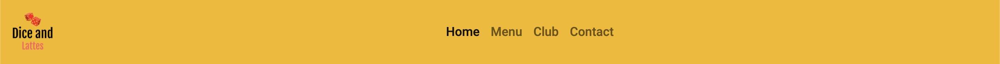

Common to all pages. On mobile view the 'hamburger icon' is used as common visual shorthand to a collapsable list of pages to navigate too.

Whilst simple, it is designed to be easy to see the purpose of, and meets an overall goal of having bright, bold colours prominent on the page. 

This meets the user stories of:

* The website is attractive and intuitive to potential customers (5).

#### **Footer**:
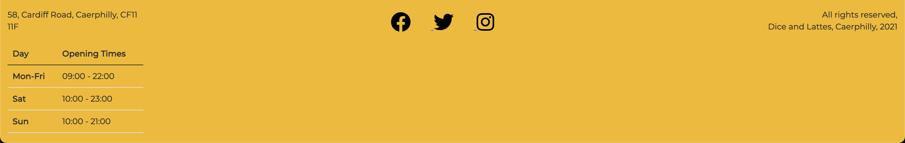

Common to all pages. On mobile view the elements stack on top of eachother (left to right). Keeping this consistant alongisde the header gives a familiar feel ot all pages, and continues the bold styling. It also includes some key information on every page, inlcuding address, opening times and the social media links for the cafe. 

This meets the user stories of:

* More people know about the business locally (1).
* Customers can find the cafe and contact us, both directly and through our social media (Facebook, Twitter and Instagram) (3)
* The website is attractive and intuitive to potential customers (5).
* Information about how to find and contact the cafe (11).

#### **Modal**:

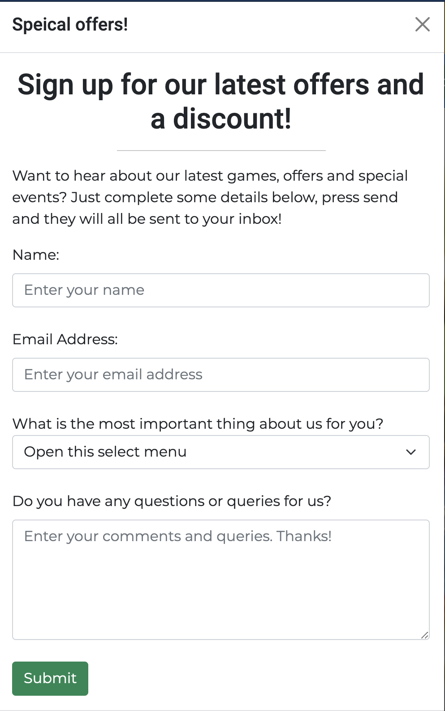

Seen twice in index.html through sign-up buttons, and again in the club.html button this is encouraged throughout as a way of keeping a dialouge between the user and the business. The use of a from to do so is familiar and it also prevents wrong information being entered by requiring the fields that are needed to keep in contact.

This meets the user stores of:

* A way to keep in touch with customers who are regulars as well as new users (7).
* A newsletter which may include dates of events and special offers (13).
* A membership to encourage repeat returns 
 (14).

#### **Hero image (index.html)**:

The image is intended to be eye-catching and entice the user to learn more about the cafe. It focusses on the game aspect of the cafe, as this is the unique part of the proposition. This also includes a call out with a link to a modal form for sign-up, which can also be accessed through the 'Click me for offers' button. In mobile view, the call-out is removed as the information is centered. 

This meets the user stories of:

* The concept is easily and clearly explained (2).
* The website is attractive and intuitive to potential customers (5).
* A newsletter which may include dates of events and special offers (13).
* A membership to encourage repeat returns (14).

### **About Us / How it Works (index.html)**:

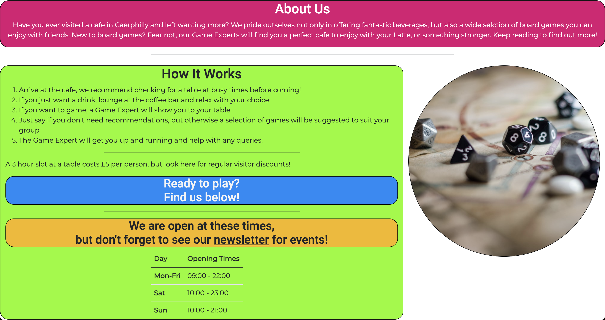

Designed to succiently give more specifics about what to expect, highlighting the differences from a usual cafe experience. It also contains links to the newsletter modal, and to the club page. The opening times don't display on mobile, but they are in the footer. Picture gives shorthand for gaming to again reinforce the difference in this cafe. At tablet views another image of the cafe also displays, as this gave better balance of the elements. Fully responsive through sizes.

This meets the user stories of:

* The concept is easily and clearly explained (2).
* Information on what is different about this cafe, easily digestible and clearly explained (8).
* A newsletter which may include dates of events and special offers (13).
* A membership to encourage repeat returns (14).

#### **Map (index.html)**:
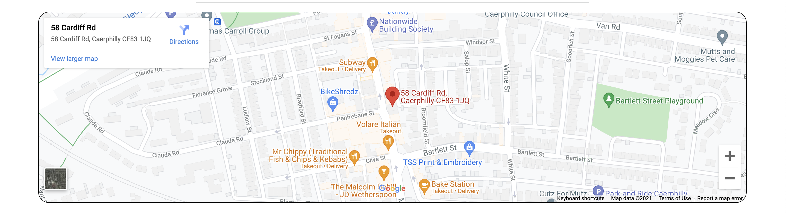

Responsive across all sizes of screen, taking up 100% of the width of a Bootstrap container. Map gives an easy way of finding the cafe which is also visually appealing to use and quite familiar with a lot of potential users. 

This meets the user stories of:

* More people know about the business locally (1).
* Customers can find the cafe and contact us, both directly and through our social media (Facebook, Twitter and Instagram) (3). 
* The website is attractive and intuitive to potential customers (5).
* Information about how to find and contact the cafe (10).

#### **Food introduction (menu.html)**:

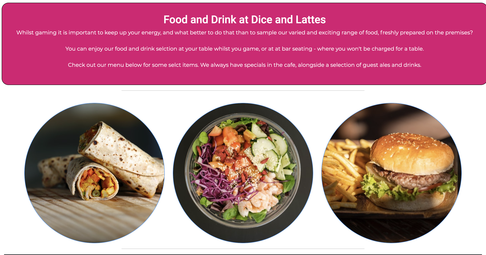

Designed to introduce the fact food and drink are served through enticing images of some options. Mobile view has images stacked vertically. Also makes a point of being able to eat while gaming, or not giving the user a choice. 

This meets the user stories of:

* A focus on the menu as well as games (4).
* The website is attractive and intuitive to potential customers (5).
* Information about the menu and pricing (10).

#### **Menu (menu.html)**:

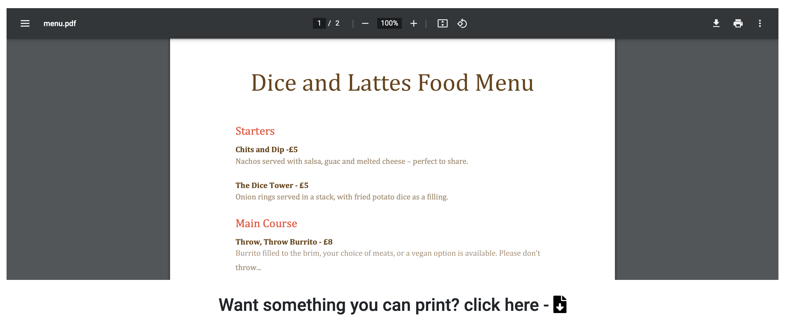

Embedded as a PDF, which allows for easy changing of the menu in the future, as well as an intuituve and attractive user experience. The user will have access to a food and drink menu. In mobile form this is changed to a static menu. This decision was made as the UI became cluttered with the embedded PDF at small screen sizes. On all sizes the option for a seperate download type link is available also. 

This meets the user stories of:

* A focus on the menu as well as games (4).
* The website is attractive and intuitive to potential customers (5).
* Information about the menu and pricing (10).

#### **Club information (club.html)**:

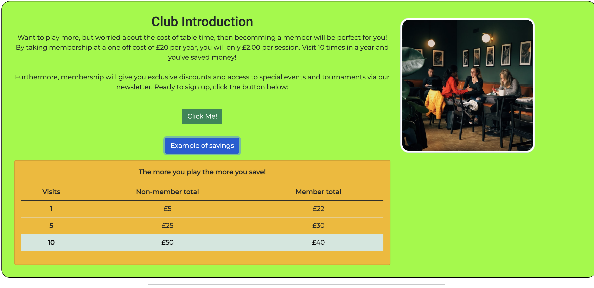

This section is intended to give information about becomming a member and the benefits. It includes a link to the modal above to sign up as well as a drop down with a table highlighting the potential to save money for regular customers. The information and images stack vertically in mobile. The images are responsive also and their display changes dependant on the screen size. 

In general this is an area more likely to be visited by repeat users, but intrigued new users may also visit. 

This meets the user stories of:

* The concept is easily and clearly explained (2).
* A membership to encourage repeat returns (14).

#### Game Recommendations (club.html)**:

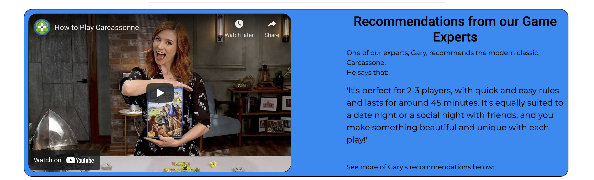

This highlights the Game Experts and gives recommendations on games which would be suitable as well as a YouTube link to a video explainign the recommendation. Designed to be intriguing to new users, but also informative to returning users in conjunction with the carousel underneth this element. Fully responsive in mobile view.

This meets the user stories of: 

* The website is attractive and intuitive to potential customers (5).
* Information on what is different about this cafe, easily digestible and clearly explained (8).
* Game recommendations for my visits (15).

#### **Carousel (club.html)**:

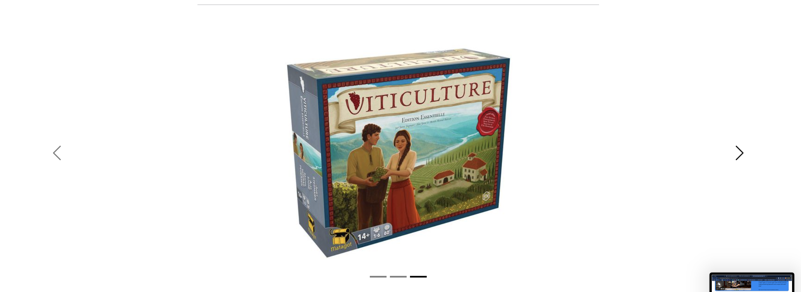

Intended as an extention to the game recommendations above this. It highlights further recommendations using attractive photos. This can also highlight the interior of the cafe in the future with set up games also. 

This meets the user stories of:

* Information on what is different about this cafe, easily digestible and clearly explained (8).
* Game recommendations for my visits (15).

#### **Contact (contact.html)**:

A combination of an invite to contact with social media links and direct email link, as well as a contact form. This gives multiple methods of contact, whilst not overwhelming the user. It repeats the visual styles of the site, and the social links are common to the rest of the site also. In mobile the contact boxes stack. The background image also improves the look and avoids the page looking sparse. 

This meets the user stories of: 

* Customers can find the cafe and contact us, both directly and through our social media (Facebook, Twitter and Instagram) (3).
* The website is attractive and intuitive to potential customers (5).
* A link to social media (9).
* Information about how to find and contact the cafe (11).

#### **404 page**:

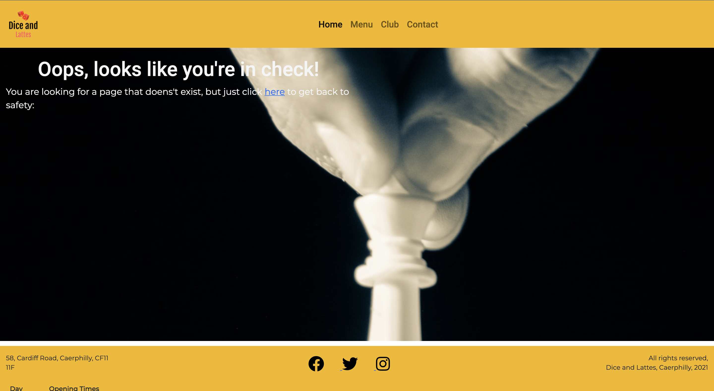

Whilst not a feature as such, it helps the user navigate if they should type a link incorrectly or the website fails in an unexpected way. It includes fmailiar navigation elements, whilst also inlcuding information in the main window of the site as to why they have ended up here. There is also a clickable link to the home page. 

This meets the user story of: 

* The website is attractive and intuitive to potential customers (5).

### Features summary

The features in the website cover the vast majority of the user stories identified in the design stage of the project. The main story not covered is around the direct booking of tables, but this was elminated from the first release of the site early on in design for a later release. 

There are several recommendations of where the site could expand to in the future however:
* A booking system a user can use directly.
* An expanded membership area, through a login with priority booking and discounts.
* An expanded recommendation area, perhaps with personalised recommendations for members. 
* A shop for games. 
* A calender for tournaments or events. 

### Technologies Used

Languages:
* HTML5
* CSS3

Frameworks:
* Bootstrap 5.0 - used through CDN link. In multiple parts of project and signposted in code.

Resources:

* Online:
  * fontawesome.com - Used through CDN link for icons.
  * icons8.com and faviconer.com - For locating and resizing favicon. 
  * freelogodesign.org - To create the cafe logo.
  * GitHub.com - Version control system. 
  * pages.github.com - For hosting final website.
  * unsplash.com, pexels.com and boardgamegeek.com - For images used through site.
  * webaim.org/resources/contrastchecker/ - Used to check contrast and solve a few validation issues.
  * ami.responsivedesign.is/ - Used to create mock-up image. 
  * coolors.co - Used to generate a color scheme.
  * fonts.google.com - Used to find good fonts for UX. 

* Local:
  * VS Code - IDE used for creating website.
  * Balsamiq - For wireframing.
  * Chrome Developer Tools - Used throughout website creation for debugging.

### Deployment:

This repository is located on Github, and has been deployed using Github Pages. 

To make a clone of the repo for your local machine, do the following:

1. Log into your GitHub account. You can then find this repository [here](https://github.com/michaelpearce21/CI_MS1_DAL)
2. Click on the 'Code' button, which will be just above the file list on the right. 
3. Copy the url starting with 'https'. There is a button next to this which will copy it as well. 
4. In your IDE make sure you are in the working directory you want then type 'git clone' and paste your copied url afterwards. Press enter. 
5. You should have a clone copy of the repository!

To fork a new copy of the repo (preserving the original copy):

1. Log in to your GitHub and find the [repo](https://github.com/michaelpearce21/CI_MS1_DAL)
2. Click 'fork' - it's at the top right of the page. 
3. You will have a copy of the repo in your own account!

To Deploy the webiste using GitHub Pages, do the following:

1. Log in to GitHub and find the [repo](https://github.com/michaelpearce21/CI_MS1_DAL)
2. Click on 'Settings' its the rightmost tab just above the file list and buttons. 
3. Find the option on the left navigation bar for 'Pages' and click it. 
4. Click 'Source'
5. Select the 'Master Branch' - it will be an option in the dropdown menu that says 'None'
6. Just wait for it to refresh, and
7. On the 'Pages' tab you'll see a link for your site!

### Testing:

#### General Testing of features and navigations:

* All navigations links have been tested across all pages, and link correctly to the right place. The logo in every page also links back to 'Home'

* The same is true of the footer, where the social media links all work across every page. 

index.html:
* Both sign up buttons open the modal as expected, the same is true with the 'newsletter' hyperlink on the page.
* The modal post's correctly to a dummy address.
* The link to the club.html page in the How it Works' section works as expected. 
* The embedded Google Maps code displays correctly and the frame can be controlled as the user would expect. 

menu.html
* Embedded PDF opens correctly on live website (there are some issues when loading page in Developer Tools) and can be manipulated as expected by the end user. 
* The PDF download link works as expected, opening the menu in a new tab. 

club.html
* 'Click me!' button opens modal as expected. 
* 'Example of savings' button reveals a drop down with a table as expected. 
* YouTube video works as expected with controls. It does become short as some smaller sizes, but as it has a link to the video this is thought acceptable. 
* Carousel displays images as expected - a recommendation for the future would be to resize images to be common as a small issue with it resizing. 

contact.html
* Form submits to a dummy server message, as expected. 
* Form also requires input before submitting as expected. 

The site has been fully tested on the following:
* Google Chrome Version 91.0.4472.77 (Official Build) (arm64): No issues. 
* Safari (Version 14.1.1 (16611.2.7.1.4)): No issues

The machine used to test these is an Apple MacBook Air M1, 2020. Google Chrome Developer Tools used to test sites at different mobile sizes throughout development. 

#### Validation Testing:

All main pages HTML have been tested using the [W3C Markup Validation Service website](https://validator.w3.org/).

No errors returned on any page, with one wanring on club.html. This warning related to not using a h1 heading. Given the layout and content, it is a design deicison not to use one. Screenshots of the validation are below:

* [Home / Index](docs/validation/home-page-validation.png)
* [Menu](docs/validation/menu-validation.png)
* [Club](docs/validation/club-validation.png)
* [Contact](docs/validation/contact-validation.png)

All main pages have been tested for accessibility using the [web accessibility evaluation tool (WAVE)](https://wave.webaim.org/).

No errors have been returned for any page. All pages do have 3 contrast errors, which relate to non-visible screenreader text attached to social media icons (see home screenshot for the code pointed too). Screenshots of this validation are below:

* [Home / Index](docs/validation/home-accesibillity-fixed.png)
* [Menu](docs/validation/menu-accesibility-fixed.png)
* [Club](docs/validation/club-accesibility-fixed.png)
* [Contact](docs/validation/contact-accesibility-fixed.png)

The Lighthouse feature in Chrome Developer Tools has also been used to assess the usability of the site. The lowest scores across the pages are; Performance: 87, Accessibilty: 95, Best Practices: 93 and SEO: 92. Screenshots of these tests are below:

* [Home / Index](docs/validation/lighthouse-home.png)
* [Menu](docs/validation/lighthouse-menu.png)
* [Club](docs/validation/lighthouse-club.png)
* [Contact](docs/validation/lighthouse-contact.png)

The style.css page was also validated by using the [W3C CSS Validation Service](https://jigsaw.w3.org/css-validator/). The validation passed with no errors, the only wanring being linked to the importing of the Google Fonts. Screenshots of the result are below:

* [CSS validation](docs/validation/css-validation.png)
* [Warning](docs/validation/css-validation-2.png)

### Bugs and Issues:

Whilst not every issue might be listed here through the process, this documents the problems which needed the most thought:

Bug: Layout of containers initially.\
Fix: Through using the Bootstrap documentation realised I was not including a 'row' element before 'col' in some containers which was leading to strange behaviour. 

Bug: Using Adobe API for PDF in menu.html - was not letting me use the Github pages url for validation\
Fix: Found a method of embedding the PDF through HTML rather than using the API. Personal development point to learn to use API's as I learn JavaScript. 

Bug: Favicon not displaying.\
Fix: Meeting with a tutor who recognised I hadn't included the full path - an easy one for another pair of eyes, but I won't forget that again.

Bug: 'Very Low Contrast' warnings during WAVE validation.\
Fix: Used the WebAIM contrat checker and changed the contrast of colours in site. There was a consistant problem with the 'whitesmoke' text I was using before, but changing this to 'white' solved the accesibility issue. It was also better to use some heavier weighted font on some boxes, which improved contrast. 

Bug: ARIA errors on social media links during WAVE validation.\
Fix: The error was related to them not having screen reader avialable text attached to them. This was resolved by borrowing some code from https://scottvinkle.me/blogs/work/hidden-content which added hidden text readable by screen readers to the link.

Bug: WAVE validator failiing as I had empty buttons.\
Fix: Realised just need to add a 'value' attribute to the HTML for the failing buttons. 

Bug: iframe issues during HTML validation. Attributes linked to the iframe were leading to validation failures.\
Fix: Before validation, inline styling was used, as inlcuded in the embedded code from YouTube and Google Maps. As it was indicated this was not correct, moved the styles to a CSS class, and added a border to improve styling wiht other on page elements too. Did initially cause another issue with the border and frame being different, then moved the class to the child rather than parent element which solved the issues. 

Bug: Issues with the live version of page and images.\
Fix: Discussed issue with tutor, advice was to include full path with repo included, which seems to have solved the issue. It was selective before however, so unsure if it was a bug with the coding or Github / Github pages.

Bug: Issue with small gap between pages with background images and the footer.\
fix: Created an id to fix the margin gap found looking on Developer Tools. Used an id to prevent any classes overiding this. 

Bug: Althogh images were responsive left a lot of white space on certain screen sizes on index and club pages. 
Fix: Used Bootstrap classes to add pictures to fill spaces at certain sizes to better balance pages, using the d-none d-lg-block classes for example. 

### Acknowledgements:

First are some inspirations and interesting resources which were useful in coming up with my own ideas and solutions:

* The Bootstrap 5 documentation was invaluable throughout not just as a source of foundation code but for solving some errors during the process. 

* Markdown table syntax taken and adapted from: https://www.makeuseof.com/tag/create-markdown-table/#:~:text=Markdown%20makes%20it%20simple%20to,even%20make%20tables%20with%20Markdown.

* Markdown image syntax taken and adapted from: https://marinegeo.github.io/2018-08-10-adding-images-markdown/

* Help solving an accessibility problem during validation found at: https://a11y-101.com/development/icons-and-links. Used to update ARIA information to improve accessibility to social media icons.

* Help embedded a PDF into the menu found at: https://stackoverflow.com/questions/14690000/how-to-embed-a-pdf.

* Help towards creating a favicon found at: https://www.lcn.com/blog/beginners-guide-favicons/. Extra help recieved from Tutor also, who helpfully recognised my path was missing a level when debugging. 

* Whilst direct code was not used from this forum post, it was helpful in creating positioning solutions: https://stackoverflow.com/questions/38160951/how-do-i-horizontally-center-a-table-in-bootstrap.

* Information linked to creating a 404 page used from: https://medium.com/designer-recipes/how-to-make-a-custom-404-error-page-for-your-website-1af37a8b20d1. An interesting read on the topic was also at: https://www.lcn.com/blog/beginners-guide-custom-404-pages/. 

* I quickly realised my Git commit messages needed more, so read this as a beginners guide: https://www.freecodecamp.org/news/writing-good-commit-messages-a-practical-guide/.

* w3schools tutorials were also used through the site, particualrly when looking at attributes. Some tips were taken when working with iframes, blockquotes, textareas, meta tags, and CSS image styling, although no blocks of code were directly included.

* YouTube and Google Maps iframe base code from using the embedded link from the respective websites, ammeded with custom CSS. 

* Mo Shami, tutor at the Code Institute was an invaluable source of direction and support in completing the project. He also gave some direct input with issues with paths in the project not displaying correctly on GitHub Pages, favicon (as above) and explaining how to set up folders correctly. An excellent example of how to set out a project was also shared, which was created by [Tara Rhoseyn](https://github.com/TaraRhoseyn)

* At this point the vast majority of my web design, coding and implementation knowledge comes from the great teaching resources at the Code Institute. Whilst direct code hasn't been used, I'm sure some good practices and inspiration would have come from this. 

* Last, and by no means least, thanks to my wife, Leanne, for the many cups of tea and welcome distracitons at the times code wasn't flowing. 

#### Direct code acknowledgement:

* Assistance in centering elements vertically wihtin containers was taken from here, specifically from 'Update 2020' comment by Zim: https://stackoverflow.com/questions/22196587/how-to-vertically-center-a-container-in-bootstrap

* Base code for embedding the PDF in the menu page came from this: https://stackoverflow.com/questions/14690000/how-to-embed-a-pdf. In particular the answer from Vuk Vasić. I'm particulary indebted as making the Adobe API work was not going well...

* Code for ARIA improvment and passing the WAVE validator from https://scottvinkle.me/blogs/work/hidden-content. This allowed me to use a visuallyhidden attribute to add screen reader text to icon only links that were present. 

* Code to help correctly size Bootstrap 5 carousel using CSS found at https://stackoverflow.com/questions/38695846/change-height-of-bootstrap-carousel-keeping-it-responsive/38696655. 

#### Media acknoweldgements:

As stated above, the images for the project have come from Pexels, Unsplash and BoardGameGeek (BGG). All images were free to use, and credited in the code. I have credited the authors below in order also:

* Index.html
  * Hero image - Christopher Paul High on Unsplash
  * Dice image - Nika Benedictova on Unsplash
  * Cafe image - Behzad Ghaffarian on Unsplash

* Menu.html
  * Burito image - Nishant Aneja on Pexels
  * Salad image - Kei Scampa on Pexels
  * Burger image - Engin Akyurt on Pexels

* Club.html
  * First cafe image - daan evers on Unsplash
  * Second cafe image - Behzad Ghaffarian on Unsplash
  * 7 Wonders - Matt Ridding on BGG
  * Azul - François Haffner on BGG
  * Viticulture - Antoine Fibula on BBG

* Contact.html
  * Background image - Dave Photoz on Unsplash

* 404.html
  * Background image - GR Stocks on Unsplash

### Disclaimer

This project is completed for the purposes of evaluation by the Code Institute towards a Diploma in Web Development. It is purely for educational purposes and is not intended as a commercial venture. 

All non-attributed code and content is created by Michael Pearce. See me on [GitHub](https://github.com/michaelpearce21/)

